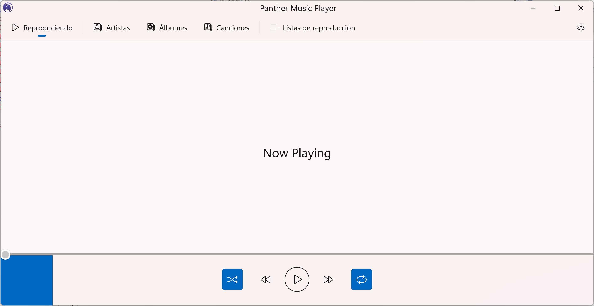

# Panther

A music player just the way I like it.

## Features

- Simple and intuitive interface
- Playlist management
- Support for multiple audio formats and sources
- Audio processing
- Lightweight and fast

## Getting Started

1. Install dependencies:

    ```ps
    cd panther
    dotnet restore
    ```

2. Build the application:

    ```ps
    dotnet build
    ```

## Screenshot

Current development status:



## License

This project is licensed under the GPLv3 License.
